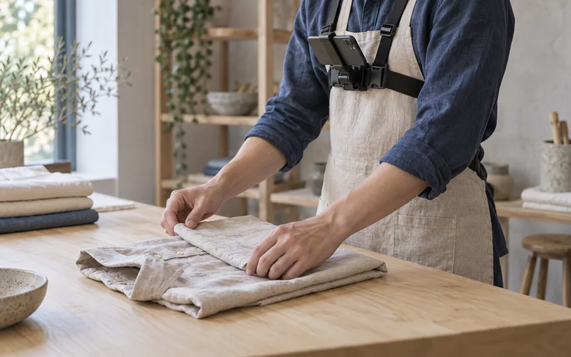
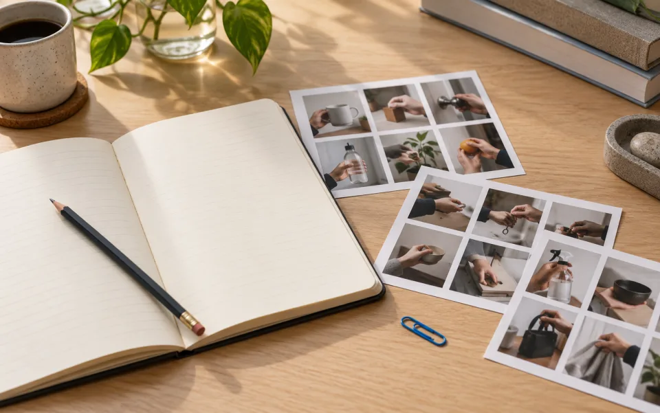
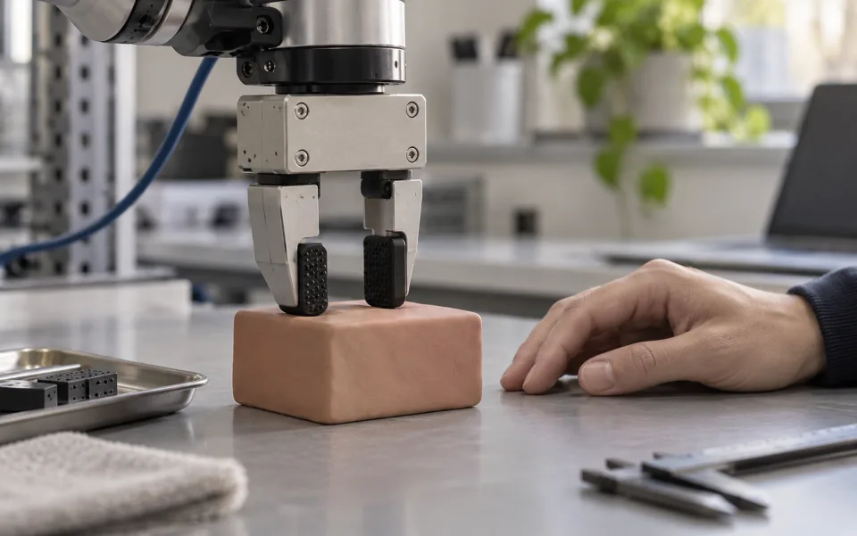

# DVIDIA Research

[Official site](https://dvidia.org/) · [Research notebook](https://research.dvidia.org/) · [Install DVIDIA Training](https://github.com/Dvidia-Inference/dvidia-training/blob/main/docs/installation.md) · [Hardware guide](https://github.com/Dvidia-Inference/dvidia-training/blob/main/docs/hardware.md) · [Frozen benchmark evidence](https://github.com/Dvidia-Inference/dvidia-training/blob/main/benchmarks/sample-count-19047/README.md)

[Recorded demo](https://huggingface.co/spaces/Dvidia/dvidia-training) · [Synthetic datasets](https://huggingface.co/datasets/Dvidia/dvidia-training-examples) · [Pilot models](https://huggingface.co/Dvidia/dvidia-training-pilot)

Small, reproducible studies of what makes a physical demonstration useful: visible evidence, defensible relationships, traceable data and measured physical grounding.

**Status: a public local CPU training tool, recorded simulation evidence, source reviews and bounded experiments.** DVIDIA Training is research alpha: visual prediction and telemetry-supervised movement remain separate. The recorded demo and pilot models cover the original one-scene simulation pilot. Human-video action recovery and qualified hardware skills remain unestablished.

Five licensed POV excerpts and 54 native CPU contact-fixture trials are recorded. The offline cable environment executes controller search, fixed-seed evaluation and skill-pack export. The original baseline protocols, GPU training and physical robot transfer remain unrun.

[Read the research agenda](reports/Physical%20skill%20research%20agenda.md) · [Start contributing](CONTRIBUTING.md)

## Choose a question

| Capture quality | Skill relations |
| --- | --- |
| [](topics/capture-quality/) | [](topics/skill-relations/) |
| **[Can we see the evidence?](topics/capture-quality/)** Compare hand visibility with human judgments of observable interactions and outcomes. | **[Can we describe what changed?](topics/skill-relations/)** Calibrate relations, then link events to actual video intervals. |
| **Evaluation and provenance** | **Physical grounding** |
| [](topics/evaluation-provenance/) | [](topics/physical-grounding/) |
| **[Can someone reproduce the result?](topics/evaluation-provenance/)** Test manifests, episode readback and split integrity. | **[What information does RGB leave out?](topics/physical-grounding/)** Compare state/contact evidence and carefully controlled synthetic augmentation. |

All four covers are **AI-generated editorial illustrations**, not footage, measurements or experimental evidence. [Image provenance](docs/assets/PROMPTS.md).

## Latest studies

[Robotics research pipeline](reports/Robotics%20research%20pipeline.md) maps the path from Skillspace originals and synchronized robot measurements to reviewed episodes, local training, frozen simulation evaluation and compatible skill installation. The diagram distinguishes implemented simulation components from proposed automatic labeling and a learned task supervisor. A new annotation-labor pilot and feedback-supervisor experiment are specified; neither has been run, and physical robot qualification remains open. [Read the public architecture](https://research.dvidia.org/papers/robotics-research-pipeline/).

[Skillspace footage training pipeline](reports/Skillspace%20footage%20training%20pipeline.md) introduces the standalone [DVIDIA Training repository](https://github.com/Dvidia-Inference/dvidia-training): audit actual footage, freeze connected source groups, fit visual weights locally and export inspectable results. Its optional movement branch requires aligned numerical actions and a supported simulation adapter. The separate [frozen sample-count benchmark](https://github.com/Dvidia-Inference/dvidia-training/blob/main/benchmarks/sample-count-19047/README.md) compares two, four and seven training groups on the same twelve layouts: nominal completion is 8/8, 7/8 and 8/8; actuator-stress completion is 3/4 for each, and all 36 matched open-jaw controls fail. This single composition-order pilot establishes no sufficient video count, human-video action bridge or hardware skill. [Inspect the protocol, outcomes and recorded evidence release](https://github.com/Dvidia-Inference/dvidia-training/releases/tag/benchmark-2026-10-08).

[Installing a Skillspace on a simulated arm](reports/Installing%20a%20Skillspace%20on%20a%20simulated%20arm.md) publishes the first public-link-to-execution product path. A local installer binds DVIDIA task metadata to one authored native-contact placement controller. The same controller completes six changed scenes; no-motion and identical arm commands with open jaws each complete 0/6. [Run the local lab, inspect the source or replay the arm](topics/physical-grounding/runs/2026-10-07-skillspace-arm/PRODUCT.md). This virtual box/arm profile has no learned video policy or physical qualification.

[Offline cable training environment](reports/Offline%20cable%20training%20environment.md) publishes the first executable practice-to-pack loop. The selected controller and fixed feedback baseline both completed 10/10 held-out simulated episodes; zero-force and release controls completed 0/10. The selected controller did not outperform the baseline. [Run the source, open its replay or inspect the pack](topics/physical-grounding/runs/2026-10-07-cable-env/README.md). This remains an ideal-attachment, privileged-state CPU simulation prototype.

[Fast accurate robot training simulation](reports/Fast%20accurate%20robot%20training%20simulation.md) translates observation-to-skill research into an offline training-environment design. The published [contact fixture](topics/physical-grounding/runs/2026-10-07-contact-fixture/) contains byte-identical benchmark code and recorded outputs for 54 CPU trials. Contact-force fidelity, deformable calibration, GPU throughput and physical transfer remain separate gates.

[Grok robotics research on X](reports/Grok%20robotics%20research%20on%20X.md) checks the initial thesis against primary literature. [Spatially grounded downloadable robot skills](reports/Spatially%20grounded%20downloadable%20robot%20skills.md) sets out the proposed controller, compatibility and evaluation contract.

[Clef and grounded video observations](reports/Clef%20and%20grounded%20video%20observations.md): five licensed POV excerpts processed, with actual costs, timings and important caption/checker failures. This is an engineering feasibility result; the separate 40-episode accuracy pilot still needs its reference set.

[From Skillspace to robot skill](reports/From%20Skillspace%20to%20robot%20skill.md) reviews Argus and proposes a measurable path from accepted videos to robot-tested releases. Includes a current implementation gap analysis, DOF compatibility requirements and an unrun [annotation pilot](topics/evaluation-provenance/experiments/0002-skill-graduation.md).

## A useful first contribution

Choose one numbered question in a topic README. Open a [research question](https://github.com/Dvidia-Inference/dvidia-research/issues/new?template=research-question.yml), identify the uncertainty and link the primary source. A source correction, clearer annotation definition or tiny reproducible fixture is a useful contribution before any model run.

Each topic has a short README, `topic.json`, `references.bib` and a proposed `experiments/0001-baseline.md`. For a new run, use the [experiment template](templates/experiment.md) and [experiment issue](https://github.com/Dvidia-Inference/dvidia-research/issues/new?template=experiment.yml). Register the split, metric and resource limit before looking at results. Negative and inconclusive results belong here when someone else can reproduce them.

The four [starter issues](https://github.com/Dvidia-Inference/dvidia-research/issues?q=is%3Aissue%20is%3Aopen%20label%3A%22help%20wanted%22) are open for contributors. Each links its protocol and acceptance checklist.

## Preview and maintain the site

Use Node.js 22 or newer. The pinned build-time Markdown parser is installed by `npm ci`; readers require no JavaScript or external font service.

```sh
npm ci --ignore-scripts
npm run check
npm test
python3 -m http.server 8201 --directory docs
```

Open `http://localhost:8201`. Edit report Markdown and `publications.json` for publications; edit topic metadata and bibliographies for questions. `npm run build` generates the topic catalog, publication and topic readers, portable downloads, RSS and sitemap. Commit source edits and generated output. The static `docs/` directory supports the custom research subdomain and a subfolder preview through relative links. Validation checks references, safe links, source provenance and deterministic output.

The journal lists actual research footprints and distinguishes source reviews, proposed protocols and executed fixtures. DVIDIA is the publisher and `hello@dvidia.org` is the team contact. Individual contributor attribution is intentionally empty pending confirmation; `@iammrriver` is a general follow link, not an asserted author identity. Raw authenticated research sessions, environment files and private execution paths are excluded from the public archive.

## Read claims at their actual scope

The [agenda](reports/Physical%20skill%20research%20agenda.md) responds to Sam Padilla's **5 October 2026** essay, [*Robotics Data: Bet Hard Or Get Out*](https://x.com/theSamPadilla/status/2107237887091843182), through specific experiments. It separates the essay's strategic opinion, author-reported technical results and our untested proposals. No private website implementation or participant data is included.

Citation keys such as `zhang2020hands` are local to each topic's `references.bib`; the same keys appear in `topic.json`. Topic prose links keys to primary URLs. Living documents use an explicitly labelled access year when a publication date is unavailable. Cite original work for its findings and [CITATION.cff](CITATION.cff) for these protocols. Record an immutable revision when actually running code or using a dataset.

Original writing and metadata use [CC BY 4.0](LICENSE); original code uses [MIT](LICENSE-CODE). Referenced code, checkpoints, media and datasets keep their own terms. Repository openness does not establish permission to redistribute a cited dataset.
