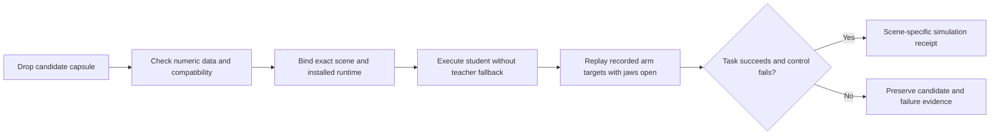

# Skill capsule acquisition and optimization

**Measured prototype and proposed next steps · 7 October 2026 · Simulation-only**

**DVIDIA now has a compact learned movement artifact that can be packaged for a compatible simulated arm.** A normalized RBF head replaces the teacher's joint-target computation; task phases, waypoints, gripper/contact supervision, and bounded recovery remain authored. The frozen head contains **34,171 canonical JSON bytes**, and the compiled candidate capsule contains **39,845 bytes**. In a new eight-scene evaluation, teacher and student both completed **7/8**, without teacher fallback, while total episode wall time increased from **6.273 to 6.360 seconds**. This establishes a bounded teacher-to-student acquisition step, with neither reliability improvement nor overall acceleration demonstrated. The useful product path is import → compatibility check → actual local execution and negative control → scene-specific qualification → execution. Human-video learning, calibrated perception/contact, and physical-arm competence remain separate future capabilities. ([Training receipt](https://research.dvidia.org/downloads/topics/physical-grounding/runs/2026-10-07-skill-capsule-v1/benchmark/training.json), [profiling](https://research.dvidia.org/downloads/topics/physical-grounding/runs/2026-10-07-skill-capsule-v1/benchmark/profiling.json), [candidate capsule](https://research.dvidia.org/downloads/topics/physical-grounding/runs/2026-10-07-skill-capsule-v1/simlab/placement_candidate.skill.json)).

## The acquired behavior is movement inside an authored task

The experiment declares 16 training scenes, four separate development-selection scenes, and eight evaluation scenes with disjoint scene digests. Historical v0.3 held-out cases were excluded and their earlier results remain unchanged. The teacher completed **16/16 collection scenes**, generating **6,344 supervised rows**: 3,172 sampled native teacher calls and 3,172 extra teacher queries with perturbed Cartesian goals at the same physical states. Augmentation adds movement labels, not another 3,172 physical attempts. The full canonical dataset occupies 3,814,171 bytes. ([Protocol](https://research.dvidia.org/downloads/topics/physical-grounding/runs/2026-10-07-skill-capsule-v1/benchmark/protocol.json), [collection](https://research.dvidia.org/downloads/topics/physical-grounding/runs/2026-10-07-skill-capsule-v1/benchmark/collection.json)).

The student learns **32 context centres and 1,152 output coefficients**. Context comprises joint positions and object/target positions relative to the tool centre; bounded Cartesian and upright-orientation errors provide movement inputs. The learned mapping predicts incremental joint targets without calculating the teacher's differential-IK Jacobian. Fitting, validation, and model-file output took approximately **0.136 seconds** on this run. This is genuine numerical parameter learning from simulator-teacher supervision, with a sharply defined role. ([Model](https://research.dvidia.org/downloads/topics/physical-grounding/runs/2026-10-07-skill-capsule-v1/benchmark/model.json), [distillation implementation](https://research.dvidia.org/downloads/topics/physical-grounding/runs/2026-10-07-skill-capsule-v1/simlab/arm_distill.py)).

The unchanged supervisor still decides approach, descend, close, lift, transfer, place, release, retreat, and verify. It supplies the requested waypoint and decides whether contact, retention, timeout, or recovery permits progress. Thus the student did not learn task meaning, grasp selection, phase sequencing, or a complete autonomous manipulation strategy. It uses privileged simulator object/contact state rather than camera or tactile measurements. The embodiment remains six ordered hinge commands plus one symmetric jaw-gap command, representing two physical jaw slides, at 50 Hz control with fixed upright tool orientation.

Both controllers passed all four selection scenes. After model/source freezing, the new evaluation produced **6/6 nominal and 1/2 actuator-stress successes for each**: seven paired successes, one paired failure, zero improvements, and zero regressions. Both failed the same insufficient-static-jaw-force case and held position until the unchanged horizon. All sixteen evaluation episodes retained valid native state. Eight heterogeneous synthetic scenes establish a candidate's behavior on that suite, not broad reliability. ([Frozen evaluation](https://research.dvidia.org/downloads/topics/physical-grounding/runs/2026-10-07-skill-capsule-v1/benchmark/evaluate.json)).

## Dragging a capsule should load competence, then test its binding

Creation and installation have different jobs. Creation collects supervision, fits normalization and parameters on training groups, selects on development rollouts, freezes the candidate, and evaluates it. Installation loads the frozen artifact without silently modifying weights. Grounding binds the current scene; calibration records permitted measured transforms or offsets; qualification executes the complete installed controller. The capsule contains exact task-source text, authored grounding, numeric movement parameters, profile, provenance, and runtime bindings. Import preserves `status: candidate`, `scope: simulation-only`, and `physical_robot_ready: false`. The current payload digest is `c02a891fbb6fc16faa4528c61366970dd332427f28ee4311cb9e869d58f7872d`. ([Capsule implementation](https://research.dvidia.org/downloads/topics/physical-grounding/runs/2026-10-07-skill-capsule-v1/simlab/skill_capsule.py)).

The implemented qualification contract requires actual student success and an open-jaw control using the identical recorded arm targets. Completion must show loaded bilateral grasp, retained table-free lift, release, tool clearance, table support, settling, target tolerance, and dwell under the native task rules. The negative control tests whether placement depends on grasp/contact rather than a supplied object trajectory. It does not validate material physics. Imported candidate provenance deliberately stores **`evaluation: null`**: the external frozen experiment did not include that control and cannot be relabeled as qualification of the installed runtime. ([Local installer](https://research.dvidia.org/downloads/topics/physical-grounding/runs/2026-10-07-skill-capsule-v1/simlab/capsule_installer.py)).

Scene-specific readiness must bind capsule, runtime, source/grounding, complete scene, actuator capacities, and seed. Changing coordinates, dimensions, mass, friction, force limits, or runtime invalidates the receipt. Import elsewhere begins again as a candidate. “Acquired” therefore means a compatible arm has loaded a learned component and demonstrated the declared behavior in this simulated scene; it does not mean arbitrary placement mastery or hardware readiness.

Native macOS network-denial qualification now passed on **one known default scene**: the student completed in **11.834 simulated seconds with 0.625 mm target error**, the identical recorded-arm/open-jaw control failed, and repeat execution succeeded. A native libc connection was denied with `EPERM` before execution. Dependencies were preinstalled. This demonstrates local installed execution and contact-dependent scene qualification; it does not establish air-gapped installation, unseen generalization, or physical capability. ([Native offline receipt](https://research.dvidia.org/downloads/topics/physical-grounding/runs/2026-10-07-skill-capsule-v1/native-offline/native-policy.json), [scene qualification](https://research.dvidia.org/downloads/topics/physical-grounding/runs/2026-10-07-skill-capsule-v1/native-offline/qualification/qualification.json)).

The browser path was verified through an actual file-picker upload of the candidate capsule. Its default 40 g scene automatically qualified; changing mass to **60 g visibly disabled Run**. Validate then executed fresh native qualification, and Run succeeded without retraining. The 60 g qualification and repeat each completed in **11.795 simulated seconds with 0.632 mm target error**. This confirms import, scene-change invalidation, requalification, and repeated execution in the interface; it adds no held-out or hardware claim. ([Qualification](https://research.dvidia.org/downloads/topics/physical-grounding/runs/2026-10-07-skill-capsule-v1/demo/qualification.json), [recorded run](https://research.dvidia.org/downloads/topics/physical-grounding/runs/2026-10-07-skill-capsule-v1/demo/run.json), [repeat](https://research.dvidia.org/downloads/topics/physical-grounding/runs/2026-10-07-skill-capsule-v1/demo-repeat/run.json)).

The parser accepts bounded plain JSON and numeric arrays, not imported executable code or pickle. It rejects duplicate/nonfinite fields, incompatible features, malformed tensors, and excessive numeric magnitudes; locally installed code owns execution. A **512 KiB outer limit** makes this initial artifact reviewable. Hashes establish content consistency, not authorship, truthful training, or execution. Even matching result JSON cannot independently attest that a worker actually ran; the trusted local worker must own execution and storage. NumPy's loader documentation illustrates why data-only numeric payloads are preferable to object-array pickle imports. ([NumPy loading semantics](https://numpy.org/doc/stable/reference/generated/numpy.load.html)).

## Native stepping dominates CPU cost, so head compression is insufficient

The student head's measured mean call cost was **35.43 μs**, versus **56.29 μs** for teacher IK, a 37.1% lower observed mean. These are each controller's own trajectories and goals, with 4,179 versus 4,196 calls; they are not an identical-input microbenchmark. Whole-policy time declined from 0.280 to 0.201 seconds, yet native stepping/observations increased from 5.910 to 6.101 seconds. Total wall time consequently increased by about 1.39%. ([Profiling receipt](https://research.dvidia.org/downloads/topics/physical-grounding/runs/2026-10-07-skill-capsule-v1/benchmark/profiling.json)).

**Native stepping and observations consumed roughly 94–96% of episode wall time.** Teacher IK accounted for approximately 3.77%; eliminating it entirely would permit only about a 3.9% speedup under an otherwise unchanged workload. The experiment therefore redirects optimization toward native stepping, contact/observation extraction, allocations, and orchestration. It does not justify a large speed claim based on the capsule's small size.

Timing covered one CPU world on macOS/arm64, Python 3.12.9, MuJoCo 3.15.0, and NumPy 2.5.3. Episodes include construction, reset/settling, initialization, policy, physics, observations, and bookkeeping. Compact receipt serialization was measured separately, excluding full traces and file I/O. Teacher cases ran before student cases; there was one execution per controller/scene, without repeated thermal/order-controlled trials. No GPU, VRAM minimum, parallel-world throughput, or cross-engine advantage was measured.

The next profiling protocol should separate native physics from observation/contact extraction, then compare trace-enabled and minimal paths on identical workloads. Reusable compiled models and reset pools are plausible optimizations, but each needs state-isolation tests and cold/warm clocks. Native continuation must preserve integration and warm-start state; exact replay is constrained by version and architecture. ([MuJoCo reproducibility](https://mujoco.readthedocs.io/en/stable/computation/index.html#reproducibility)). CPU batching and later GPU batches require separately qualified contact/features and aggregate versus per-world timing. Keep timestep, solver/contact settings, actuator caps, success predicates, and horizons fixed; a cheaper approximation cannot earn a speed claim by omitting required interactions.

## Better supervision and explicit compatibility should guide expansion

The next acquisition cycle should freeze fresh development and evaluation groups, collect student-visited supported states, and obtain corrective teacher labels only where the teacher provides valid actions. DAgger supplies precedent for this distribution-shift problem: a learner visits states absent from expert trajectories. ([Ross, Gordon and Bagnell](https://proceedings.mlr.press/v15/ross11a/ross11a.pdf)). Compare goal/context ablations, zero/constant heads, actuator boundaries, delays/noise, recovery budgets, and open-jaw controls. Low prediction error and full rollout success answer different questions. Keep teacher intervention counts explicit and autonomous final tests free of substitution.

Keep complete trajectories and their augmented descendants in one split, and fit normalization and hyperparameters using training/development only. Preserve requested versus actually applied commands, timestamps, teacher revision, contact state, and failed/corrective attempts. Disjoint scene hashes are useful integrity evidence; they do not independently rule out near-duplicates, correlated scene families, or prior exposure to evaluation. Those require collection provenance and grouped protocols.

Human footage can support task labels, phases, affordances, representations, and geometric hypotheses. It does not directly provide joint commands, gripper forces, or calibrated material state. R3M separates human-video representation learning from downstream robot-action training; UMI uses an instrumented capture/control bridge. ([R3M](https://arxiv.org/abs/2203.12601), [UMI](https://umi-gripper.github.io/)). A future video route needs measured or validated reconstruction/retargeting, uncertainty, action alignment, and an independently tested observation bridge. This prototype uses neither human-video motor supervision nor learned perception.

Capsules should freeze feature order, shapes, units, frames, normalization, output semantics, bounds, control timing, and episode reset/history. LeRobot's processor contract makes translation between observation fields, coordinate systems, normalization, and robot outputs explicit. ([Official processors](https://huggingface.co/docs/lerobot/introduction_processors)). A new morphology or gripper requires an adapter and fresh evaluation; matching DOF counts is insufficient. Recurrence should be added only when history resolves ambiguity, with explicit state-reset/serialization semantics, rather than as a substitute for missing sensing.

Future task families need separate gates. Rigid placement adds collision-enabled links/palm, obstacles, orientation, and geometry coverage. Articulated manipulation adds axes, limits, handles, and latches. Insertion/wiping adds clearance, force/compliance, and jam/retraction checks. Deformables add material dynamics, contact/topological state, and verified knots/folds. Bimanual skills add synchronized profiles, relative-base transforms, inter-arm collision, and load sharing. A task graph can compose these only when one capsule's postconditions satisfy the next capsule's initiation conditions; evaluate the complete chain and preserve failure/recovery edges.

The new full suite passed **124 tests in 40.048 seconds**. This establishes implementation checks, not 124 independent skill episodes. A Grok 4.7 consultation contributed adversarial methodological critique; primary documentation supports the concrete claims, and the local receipts supply the measurements. No physical calibration, robot execution, or contact-accuracy validation occurred. MuJoCo explicitly treats contact as an approximation requiring parameter identification. ([Contact realism](https://mujoco.readthedocs.io/en/stable/computation/index.html#physical-realism-and-soft-contacts)).

## Conclusion

The useful capsule is **frozen learned parameters plus the exact machinery that gives them meaning**. This prototype shows a small movement component can preserve an authored teacher's outcomes on a new bounded suite. Its value is transferable computation and an inspectable acquisition contract, while the measured bottleneck remains native stepping and observation work.

Keep candidate integrity, local execution, independent task evaluation, and physical qualification as distinct evidence. Optimize the measured bottleneck, request demonstrations that resolve missing decisions, and release only the capability the complete installed controller has established. The [source bundle](https://research.dvidia.org/downloads/topics/physical-grounding/runs/2026-10-07-skill-capsule-v1/release/simlab-v0.4.zip) and [candidate capsule](https://research.dvidia.org/downloads/topics/physical-grounding/runs/2026-10-07-skill-capsule-v1/simlab/placement_candidate.skill.json) make that bounded research artifact concrete.
