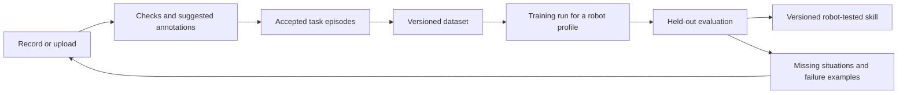

# From Skillspace to robot skill

**Source review and proposal · 6 October 2026 · Experiments not run**

A Skillspace can become the home for a skill's learning history. More uploaded videos do not, by themselves, establish a better policy. We need evidence that new demonstrations add useful coverage, survive quality checks, and improve held-out performance on a specified robot.

This review follows [Varun Nair's pipeline post](https://x.com/_varunnair/status/2107188112980054270), its linked Argus article, selected upstream source files, and an audit of the DVIDIA website. The design below is our proposal, not an implemented training service. No user footage was sent to any model, no training was run, and no robot was operated for this review.

## What the linked work contributes

Pantheon's **Argus** combines temporal visual annotation with deterministic data checks. The authors report medium-or-higher issues in 27% of 3,546 audited episodes. That is an author-reported finding on their sample, not an estimate for our corpus. Their comparison uses Astra as a reference; agreement with it and higher annotation density do not independently establish correctness or better policy learning. The article's moving-camera and misleading-instruction examples are especially relevant to neck-mounted POV capture. [li2026argus]

The inspected repository revision is `6c99686a3d93027c517f02f37f24b5b68532e12a`. It separates preparation, checks, labeling, review and display. Runs preserve settings and outputs; its documentation acknowledges nondeterministic labels. `label/frames.py` checks exact frame PTS, respects rotation/mirroring, limits decoding threads and releases full-resolution images after preparing smaller views. This is a useful reference for a server-side adapter, not a mobile recording dependency. [pantheon2026argus]

Upstream code is Apache-2.0 with third-party notices. Optional hand-pose dependencies and outputs carry additional restrictions, including non-commercial terms described by upstream. Do not assume the repository license covers checkpoints, source footage or generated annotations. Keep the initial integration limited to ingestion, checks and labels; review optional dependencies separately. [argus2026notices]

**Recommendation:** adopt the evidence discipline first. Evaluate a narrow Argus-compatible adapter before importing its full dashboard, hand-pose stack or model choices.

## What DVIDIA actually has

Implementation audit snapshot: 6 October 2026. These are findings from internal source review, not claims about uninspected private records. This public report summarizes behavior without reproducing private source or account data.

| Area | Present foundation | Missing connection |
| --- | --- | --- |
| Account Skillspaces | Owned spaces, private originals, file hashes and consent records | Personal spaces are currently named collections; their generic saved brief is not a versioned task specification |
| Curation | Separate tooling supports temporal segments, before/after states, uncertainty, revisioned briefs and review decisions | New account uploads do not automatically become curated training episodes |
| Dataset releases | Rights-aware metadata releases and provenance | A metadata export is not a synchronized observation/action training set |
| Coverage | Counts distinguish several evidence states | Coverage is explicitly unknown; no target distribution or measured learning curve |
| Readiness | An explanatory four-stage interface | No automatic training or graduation process |
| Robot delivery | Exact-profile package validation and a limited adapter path | No demonstrated transfer from these Skillspaces, independent graduation test or arbitrary-robot support |

The valuable foundation is traceability. Connect those existing pieces through stable IDs and immutable versions rather than introducing another disconnected upload workflow.

## The proposed learning loop

An uploaded original remains immutable. Annotation revisions, consent, dataset membership and model artifacts reference it; they never overwrite it. An episode with a useful recovery can be valuable even when the attempt failed. Preserve outcomes and mark segments eligible for imitation, recovery learning or evaluation separately.

Proposed records:

- **Task version:** observable goal, start/end conditions, required objects, success rubric, failure categories and target capture situations.
- **Episode:** original hash, consent reference, task version, source/session grouping, camera setup, exact timebase and segment boundaries. Missing calibration or robot actions remain explicitly missing.
- **Annotation run:** input/frame digests, model/provider revision, prompt and recipe hashes, cost, evidence intervals, confidence and abstentions. Keep proposed and reviewed judgments distinct.
- **Dataset version:** accepted episode revisions, rights decision, duplicate groups, exclusions, frozen splits and intended training purpose.
- **Training run:** dataset digest, base checkpoint, code/environment, seed, optimization budget, action schema and output checkpoint digest.
- **Evaluation and skill release:** robot profile, test-suite version, trials, strict successes, interventions, failure slices, uncertainty, reviewer and release signature.

An annotation outcome and a policy success rate belong to different records. A generated pose or inferred action must never silently become measured robot supervision.

## What “more videos” should mean

Volume is useful only relative to a task and learning recipe. Repeated near-identical clips may add little; corrupted labels or train/test leakage can make an apparent gain misleading. Open X-Embodiment provides evidence that combined robot datasets can produce positive transfer in studied settings, not that every additional phone video improves every robot. [oxe2025]

For the initial task, define a small coverage matrix: object variation, starting arrangement, camera setup, demonstrator/session, successful completion, and recoverable failure. Derive it from the task and deployment environment. Do not grade a person's skill, location or filming aesthetics as a substitute for usable evidence.

Show separate counts for **uploaded**, **accepted**, **unique sessions**, **outcomes visible**, and **robot-aligned**. A coverage percentage is meaningful only after its denominator is versioned. Never label bytes stored, videos tagged or a checklist percentage “training complete.”

Choose the next requested recording from an uncovered situation or measured model failure. Candidate priorities can consider the missing condition, annotation uncertainty, duplicate burden and collection cost. Keep those scores provisional until an ablation shows they select more useful training data.

## The bridge from phone video to robot action

POV video can support task descriptions, temporal segmentation, visual representations, outcome recognition and collection planning. Direct supervised control usually needs an action-learning bridge: paired robot demonstrations, measured interaction hardware, validated retargeting, or a separately evaluated method for learning actions from observation.

UMI is relevant because it combines handheld grippers with a designed trajectory/control interface and latency handling. Its reported transfer relies on that system; it does not demonstrate that ordinary neck-mounted phone footage alone supplies equivalent action supervision. [chi2024umi]

Our lowest-risk first control experiment is a simple object-placement task on one fixed robot/camera setup. Keep a robot-demonstration baseline. Add human-video-derived signals as a separate controlled change; otherwise improvement cannot be attributed to the phone footage.

## DOFs and compatibility

Here **DOF** means degrees of freedom. It describes independent motion capability; actuators and a controller execute a policy. Matching a numeric DOF count is insufficient to select a compatible skill.

RT-X's published interface, for example, distinguishes translation, rotation and gripper movement, with explicit action semantics. These are not interchangeable with an arbitrary vector of joint angles. MoveIt likewise depends on a robot model, joint limits and collision geometry. [oxe2026interface] [moveit2026model]

A proposed `robot_profile` should specify robot/model revision; ordered joints and units; control mode and rate; actuator limits; gripper type/opening; camera streams, intrinsics/extrinsics and calibration hashes; coordinate frames; observation/action schema; and runtime requirements. Execution should reject unknown or mismatched profiles.

DVIDIA's inspected SO-101 profile names **five arm joints plus a gripper channel**. Six output channels do not imply unrestricted six-DOF Cartesian motion. A policy tested on this profile must not receive a generic “all robots” badge. New hardware needs an adapter and its own evaluation record.

## Graduation should require evidence

| Stage shown to people | Evidence required to enter | Main next action |
| --- | --- | --- |
| Collecting | Task and rights defined | Record the missing example |
| Dataset ready | Frozen accepted episodes, quality checks, splits and intended use | Review the dataset version |
| Training | Real run ID and resource budget | View run status |
| Testing | Checkpoint and fixed evaluation protocol | See results and failures |
| Robot-tested | Passed task-specific criteria on a named physical setup | View compatible robots and install requirements |

A trained checkpoint may remain in testing, fail, or be retired. Simulation success and physical success must remain separately labeled. Test criteria must be agreed before results are inspected. A release should state its operating limits; a badge never replaces them.

Keep **Everyday / Skilled / Specialist / Artisan** as task-character descriptors. They are separate from training maturity, compatibility and reward eligibility. Artisan is not automatically more robot-ready.

For composed skills, store preconditions, postconditions, required resources and failure/recovery transitions. A video showing A before B is evidence of sequence, not proof that A is a prerequisite. Test the complete chain: isolated component success is not end-to-end reliability.

## A simple mobile presentation

Retain three views: **Overview · Videos · Results**. The overview has a short stage rail, one useful gap and one primary action. Example copy, explicitly a design example rather than live counts:

> Collecting · We need examples with different starting positions.
>
> Record an example

Videos have a thumbnail and one status: Checking, Needs detail, Accepted or Excluded. Open a video to see its timeline and optional corrections. Results shows the dataset version, real evaluation evidence and a robot compatibility chip when available. Put technical details behind a disclosure, not in the upload path.

Keep upload progress and background annotation progress separate. Show actual bytes for upload; use named analysis stages when remaining time is unknown. Dense analysis runs asynchronously on the server, with cached frame/recipe results, bounded queues and retry-safe jobs. A model timeout must not lose a saved original or block normal account navigation.

## Next work, in order

1. Link personal spaces to a stable task specification and existing curation IDs.
2. Add a versioned annotation adapter and deterministic media checks with explicit permissions and cost caps.
3. Define one coverage matrix and frozen episode-level split; route users toward a missing example.
4. Execute the [small annotation pilot](../topics/evaluation-provenance/experiments/0002-skill-graduation.md).
5. Separately validate the observation-to-action bridge and a robot training/evaluation loop.
6. Only then activate a graduation badge backed by a signed, versioned evaluation receipt.

The first deliverable is evidence that our accepted episodes and annotations are reliable—not an automatic promise of robot learning. Commercial training permissions and contributor revenue terms remain separate from storage, public visibility and these research protocols.

## Sources

- [li2026argus] Eric Li, [Argus: An Open-Source Annotator for Robotics Data](https://pantheon.inc/research/argus), 1 October 2026. Author-reported results; not independently reproduced here.
- [pantheon2026argus] Pantheon, [Argus at inspected revision](https://github.com/Pantheon-Industries-Inc/argus/tree/6c99686a3d93027c517f02f37f24b5b68532e12a), accessed 6 October 2026. [Exact frame decoding](https://github.com/Pantheon-Industries-Inc/argus/blob/6c99686a3d93027c517f02f37f24b5b68532e12a/label/frames.py).
- [argus2026notices] Pantheon, [third-party notices](https://github.com/Pantheon-Industries-Inc/argus/blob/6c99686a3d93027c517f02f37f24b5b68532e12a/THIRD_PARTY_NOTICES.txt), accessed 6 October 2026.
- [chi2024umi] Cheng Chi et al., [Universal Manipulation Interface](https://arxiv.org/abs/2402.10329v3), 2024.
- [oxe2025] Open X-Embodiment Collaboration, [Open X-Embodiment: Robotic Learning Datasets and RT-X Models](https://arxiv.org/abs/2310.08864v9), revision 2025; initially submitted 2023.
- [oxe2026interface] Google DeepMind, [RT-X observation/action interface](https://github.com/google-deepmind/open_x_embodiment/blob/main/README.md), living documentation accessed 6 October 2026.
- [moveit2026model] MoveIt, [URDF and SRDF](https://moveit.picknik.ai/main/doc/examples/urdf_srdf/urdf_srdf_tutorial.html), living documentation accessed 6 October 2026.

Bibliographic entries: [evaluation and provenance bibliography](../topics/evaluation-provenance/references.bib). This report's open documentation license does not license user videos or downstream training data.
