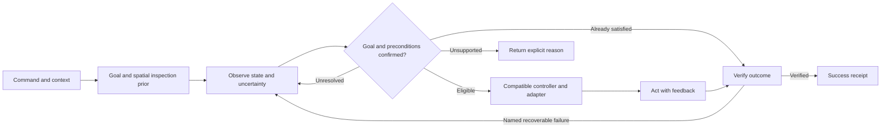

# Spatially grounded downloadable robot skills

**Research synthesis and proposed experiments · 7 October 2026 · No DVIDIA experiment in this report has run**

My judgment is that the thesis identifies a useful architecture, but its strongest version needs a measurable operating boundary. Human demonstrations can teach what a task means, which state changes matter, and where to inspect; turning those observations into robot control needs an action and embodiment bridge. A command-conditioned spatial prior could accelerate target discovery, provided observation corrects it when a shoe is on a table or the person changes posture. Simulation can expand grounded experience, but generated volume cannot establish coverage of every material, contact, damaged object, or recovery. **Fifty examples could adapt a substantial pretrained physical skill model; they are not an established threshold for acquiring all of shoe tying.** The falsifiable research claim is: *for a fixed pretrained model and robot, task-state annotations, spatially directed inspection, and targeted real/simulated recovery data improve held-out physical success per unit of collection cost, while preserving performance on unusual placements*. A downloadable skill is the resulting tested controller, its compatibility and task contract, and evidence of where it works.

This synthesis combines three parallel primary-source research tracks with the existing DVIDIA research context. **Grok 4.7 was inaccessible and was not used**: the inspected browser was signed out, the exact model could not be verified, and no prompt or response exists. Recent 2026 results below include author-reported preprints; none was independently reproduced here. Architecture, experiments, budgets, and release criteria are proposals.

## Demonstrations teach meaning before they supply motor control

The useful first separation is between understanding a task and executing it. Watching someone tie a shoe can establish the intended object, stages, plausible initial states, and the appearance of a bow. Associating that sequence with “tie your shoes” makes the phrase a retrieval cue. Executing the task requires deciding which shoe is intended, whether it already satisfies the goal, whether the laces are usable, and which actions are feasible now. A word sequence indexes a goal and a family of behaviors; it does not supply a complete physical state or motor program.

This supports the thesis’s emphasis on confirming the state before acting. “Tie your shoes” should first bind a referent and a desired state. An already secured shoe calls for verification; an untied shoe calls for a controller; an ambiguous or absent shoe calls for more observation. A cut lace is not automatically impossible, because usable remaining length and permissible repair matter. A lace too short for the specified bow is ineligible for that goal, even if the robot recognizes the command perfectly. Repairing or replacing it introduces another skill and additional resources.

Ordinary RGB footage, instrumented human demonstrations, and synchronized robot observations/actions are three distinct supervision sources. RGB can support semantic goals, phase recognition, object relations, and outcome labels. Metric motion capture adds trajectory information. Robot-aligned capture supplies actions in a specified control interface. A camera can show an endpoint moving without revealing depth, hidden crossings, grip force, tension, or why a grasp slipped. These unknowns become critical for deformable manipulation. They can be addressed through views, history, measured sensing, or validated latent models; labeling them confidently does not make them observed.

UMI demonstrates an explicit bridge: compatible handheld/robot grippers, wrist cameras, visual-inertial pose recovery, gripper-width observations, relative trajectories, and latency handling. Its cup experiment used **305 episodes**, achieving 20/20 successes in-domain and 18/20 on another arm, with joint limits causing the two failures. A broader cup dataset contained **1,400 demonstrations across 30 locations and 15 cups**, collected in 12 person-hours; it achieved 43/60 trials in unseen environments versus 0% for the narrow-data baseline with the same pretrained vision backbone. These are cup results, and count and diversity both changed, so the comparison does not isolate their separate effects. ([UMI, primary paper](https://arxiv.org/html/2402.10329v3)).

EgoMimic likewise makes alignment part of the method: Aria glasses, a bimanual manipulator chosen to reduce the kinematic gap, shared pose prediction, robot joint-action prediction, and human/robot co-training. For continuous object-in-bowl, two hours of robot data plus one hour of human data outperformed ACT trained on three hours of robot data. The authors identify entirely new human-only behaviors and new embodiments as future work. That is evidence that human data can help a grounded policy, with a defined scope. ([EgoMimic, authors' project](https://egomimic.github.io/)). SPOT offers another bridge through target-relative object pose trajectories and a conditioned controller, including action-less human demonstrations, within studied object-centric tasks. ([SPOT, primary publication](https://research.nvidia.com/publication/2025-05_spot-se3-pose-trajectory-diffusion-object-centric-manipulation)).

### Fifty examples can mean adaptation or missing physics

**50 clips × 10 seconds = 8 minutes 20 seconds.** Thirty minutes contains 180 ten-second clips; fifty minutes contains 300. More importantly, duration, complete attempts, independently reset starts, distinct people, and covered decisions measure different things. Ten seconds can omit the initial lace configuration or final verification. Fifty fragments from one attempt are not fifty independent demonstrations.

The strongest few-shot interpretation is credible: a reusable base model already knows endpoint identification, grasping, loops, pulling, contact-sensitive feedback, and recovery, and the new examples specify their arrangement or a new object. A small adaptation set then inherits substantial earlier learning. If the base model lacks those capabilities, the same count must also teach them. A fair experiment fixes and discloses the base checkpoint, upstream training, sensors, controller, and training budget; large per-task datasets in another system do not establish a universal minimum.

For DVIDIA, the denominator should be a declared task distribution. “All possibilities” has no finite closure when shoes, materials, wear, damage, posture, and hardware can change. A useful initial claim is narrower: selected shoe/lace families, tabletop starts, one robot profile, named recoveries, and independently measured completion. Collection should seek missing decisions—lost grasp, unequal usable ends, collapsed loop, obscured crossing—alongside successful attempts. Repeating an easy trajectory and adding a new recovery branch are different investments.

## Spatial priors can shorten inspection without determining the task

Two hypotheses are easily conflated. **Predicting the task from position**, roughly `P(task | XYZ, context)`, helps interpret video but remains ambiguous: the same table supports sorting, eating, repair, and shoe tying. **Predicting where to inspect from the command**, roughly `P(region | goal, posture, scene, embodiment)`, is the stronger speed hypothesis. A shoe-related command biases attention toward likely shoes; object observations then confirm or revise that guess. Its contribution is efficient evidence acquisition.

Coordinate frames explain why the intuition works and where a fixed rule breaks. A gravity-aligned world frame supports physical geometry; a robot-base frame supports reachability; a body/posture frame supports coarse attention; a shoe frame supports manipulation. Sitting, bending, lifting a foot, moving the camera, and placing a shoe on a table change their relationships. A rigid pose includes rotation as well as XYZ. Object-relative goals can remain meaningful as the whole scene moves, while joint limits, gravity, obstacles, and support contacts still constrain execution.

Frame adaptation is established prior art. Calinon's task-parameterized movement models adapt demonstrations through landmark/reference-frame transformations. ([Calinon, author paper](https://calinon.ch/papers/Calinon-ISRR2015.pdf)). VoxPoser already converts language and RGB-D observations into spatial affordance/constraint maps and replans with feedback; its authors identify fine geometry and general contact dynamics as limitations. ([VoxPoser, primary paper](https://arxiv.org/html/2307.05973)). SEEK uses semantic relational priors for object search and reports worse search efficiency than room coverage for unexpectedly placed targets with low prior probability. Its scope is navigation, not torso-relative hand control, but the failure mechanism directly motivates a fallback. ([SEEK, RSS 2024](https://www.roboticsproceedings.org/rss20/p024.pdf)).

The proposed attention policy should therefore rank regions, retain uncertainty, inspect outside the top region, and broaden after negative evidence. A shoe on a table should revise the prior. A target-absent scene should end in bounded search and a missing-target outcome. The speed claim must include the cost of estimating posture, calibrating frames, predicting regions, moving a camera or extracting crops, and confirming the target. If computing the shortcut first requires an expensive full scan, there is no automatic saving. Digital crop selection and physical gaze movement also have different costs and should be measured separately.

### Laces occupy a region but carry a changing task state

Hand XYZ does not distinguish gripping from touching, a loop from a crossing, or a tight bow from a visually similar loose knot. A useful lace state includes endpoint identity and usable length, attachment through eyelets, loop/crossing relations, gripper contacts and slip, tension/compliance, observation history, and robot configuration. Nearly identical spatial envelopes can require different next actions. **The controller must preserve action-relevant distinctions; an explicit topology graph is one representation choice, not a universal requirement.**

RoboHitch illustrates both sides. It learns knotting affordances from **100 human videos**, RGB and unordered 3D rope keypoints, achieving **42/50** hitch knots on its trained nylon rope with one UR10 and a modified gripper. The reported material/diameter slices contain just five trials: 3/5 on thicker nylon and 0/5 on polypropylene, attributed to stiffness. A hitch is a different knot and task from a shoelace bow, and those small slices are diagnostic rather than precise probabilities. ([RoboHitch, primary paper](https://arxiv.org/html/2605.24394v1)). Geometry-guided control can therefore be useful without complete symbolic topology, while material changes still defeat it.

We would treat the spatial module as an independently testable accelerator. Its success does not establish action-learning efficiency, a causal model of physics, or the proposed human reaction-time mechanism. Those are separate claims. The defensible result is lower total command-to-correct-target latency with preserved downstream success, including prior violations.

## Simulation expands grounded experience; physical tests establish competence

“Simulation” names several different processes. A physics simulator evolves modeled state under actions, contact, and dynamics. Generated video supplies plausible pixels and can diversify appearance or representations. An action-conditioned learned world model predicts consequences of commands. Controller training or planning then selects actions toward a goal. **A transition model does not become a skill merely by generating enough outcomes.** A skill emerges from an executable decision process, feedback, and tested completion.

MimicGen demonstrates useful task-specific expansion: more than 50,000 generated demonstrations from fewer than 200 human demonstrations across 18 tasks. Its recipes operate on structured demonstration/control information rather than assuming ordinary video uniquely determines physics. ([MimicGen, authors' project](https://mimicgen.github.io/)). DexMimicGen's physical result is particularly instructive: **four source human demonstrations seeded proposals that were executed on hardware to collect 40 real robot demonstrations**. A trained can-sorting policy then achieved **18/20**, versus 0/20 for the four-source baseline. This includes additional physical grounding; it is not four clips plus imaginary experience yielding verified robot competence. ([DexMimicGen, primary paper](https://arxiv.org/html/2410.24185v1)).

Video priors can still help. Cosmos Policy adapts video pretraining with target-platform robot actions, future observations, and value predictions. Its planning-model refinement used **648 physical policy rollouts**, including additional bag-task rollouts, to address failures that demonstration-only predictions missed. ([Cosmos Policy, primary paper](https://arxiv.org/html/2601.16163v1)). WorldEcho/WorldSync's recent action-intervention evaluation reports models that behave plausibly on expert actions yet ignore off-expert commands or predict invalid futures. ([WorldEcho/WorldSync, August 2026 preprint](https://arxiv.org/html/2608.24885v1)). These results make a specific test necessary: does the model predict the effect of a changed grip, pull, or release well enough to rank alternative actions?

For laces, real calibration should cover stiffness, friction, gripper contact, slack, tension, latency, and camera geometry. Randomized backgrounds address appearance; they do not identify those dynamics. Parameter randomization should span plausible measured uncertainty. Re-grounding during execution checks whether the imagined state still matches the observed lace. A planner otherwise risks exploiting a simulator's favorable contact error. Millions of synthetic descendants can repeat one mistaken assumption.

### Robots can trial and error, with feedback and a reset strategy

Robots already learn through physical interaction. DayDreamer trained a quadruped to roll over, stand, and walk in roughly one hour, with later adaptation to pushes. Its reward, filtered motor interface, and boundary interventions were engineered; its manipulation setup also constrained actions. ([DayDreamer, primary paper](https://proceedings.mlr.press/v205/wu23c/wu23c.pdf)). The answer to “can robots trial and error?” is yes. The research difficulty is observing the relevant failure, selecting informative allowable actions, evaluating outcomes, and recovering or resetting.

The clearest reviewed shoe-tying evidence is ALOHA Unleashed. A single Lace policy used **5,133 physical teleoperation episodes**, split into 2,212 Easy and 2,921 Messy. It achieved **70% Easy and 40% Messy**, with **20 trials per variant and an 80-second limit**. Two arms, parallel-jaw grippers, four RGB views, and proprioception ground the controls. The full task centers the shoe, straightens laces, and ties a bow; reported failures include tipped/flipped shoes and tangles outside training. Recovery appears in the behavior, but broad reliability remains unestablished. These counts describe one method rather than lower bounds for future pretrained models. ([ALOHA Unleashed, primary paper](https://arxiv.org/html/2410.13126v1)).

This also answers when simulation “turns into” a skill. Demonstrations define behavior and physical hypotheses; measured traces calibrate the model; simulated or real rollouts train a feedback controller; held-out tests measure its envelope; physical trials qualify a named release. Each stage can fail. Simulation success remains useful evidence about the simulator task, while physical competence requires physical outcomes. Evaluation must distinguish visually completed bows from knots whose security was actually tested.

## Download the contract, compatible controller, and evidence together

The options framework gives the compact definition: **a skill has an initiation set `I`, a policy `π`, and a termination rule `β`**. ([Sutton, Precup and Singh, primary paper](https://people.cs.umass.edu/~barto/courses/cs687/Sutton-Precup-Singh-AIJ99.pdf)). In this setting, initiation checks the intended shoe, observable supported state, usable materials, sensing, and reachability. The policy uses feedback and permitted recovery. Termination distinguishes verified success, already satisfied, unresolved observation, failed attempt, and unsupported condition. SayCan similarly distinguishes semantic usefulness from current-state completion affordance. ([SayCan, primary paper](https://arxiv.org/html/2204.01691)).

The proposed runtime connects these components:



This is a proposal, not an implemented robot pipeline. Reinspection and retries need time/attempt budgets; the diagram's loop does not imply indefinite exploration. A world model can propose a recovery, but a released skill should execute it only within its tested conditions. Online weight changes create a new candidate requiring regression evaluation. Runtime adaptation through observations and validated feedback can stay within an existing envelope.

A transferable task description and an executable controller are separate artifacts. “Secure a releasable bow on this shoe” can survive embodiment changes. Joint commands, pinch geometry, contact strategy, control rate, available arms, and sensing do not transfer automatically. MoveIt's model/state machinery illustrates why joint relationships, limits, collision geometry, and current configuration matter. ([MoveIt, official documentation](https://moveit.picknik.ai/main/doc/examples/robot_model_and_robot_state/robot_model_and_robot_state_tutorial.html)). A single-arm fixture strategy can be valid, but its fixture and contacts belong in the profile. Matching a DOF count does not validate installation.

The minimal contract below is illustrative; artifact references and thresholds require real evidence:

```yaml
task: secure_releasable_bow_on_selected_shoe
status: research_only
initiation: resolved_target_and_supported_lace_state_and_reachability
controller: profile_specific_artifact_and_validated_adapter
observations: declared_sensors_frames_history_and_latency
recovery: named_tested_branches_with_attempt_and_time_limits
termination: verified_success_or_already_satisfied_or_explicit_failure
envelope: tested_shoes_materials_starts_contacts_and_robot_revision
evidence: dataset_and_checkpoint_hashes_physical_trials_and_failure_slices
```

Success verification deserves its own calibration. A plausible-looking bow can be loose, incorrectly crossed, or retained by the gripper. The fixture protocol should define topology, retained loops, usable end lengths, mechanical retention, timeout, and intervention rules. Pull/force criteria depend on the chosen shoe/lace/profile and must be measured before use. If only appearance is observed, report visual completion. Calibrate eligibility and verifier errors on held-out data; language-model confidence is not a measured physical success probability.

The existing DVIDIA reviews describe useful provenance and curation foundations, but no established Skillspace-to-controller transfer. Their proposed sequence—original recording, reviewed episode, immutable dataset, training run, evaluation, release—fits this architecture. Those reviews are project context, not robot-performance evidence. ([Earlier Skillspace review](https://github.com/Dvidia-Inference/dvidia-research/blob/main/reports/From%20Skillspace%20to%20robot%20skill.md), [physical evidence agenda](https://github.com/Dvidia-Inference/dvidia-research/blob/main/reports/Physical%20skill%20research%20agenda.md)).

## DVIDIA should test data value before scaling the library

Much of the architecture has prior art: language grounding, reference-frame adaptation, semantic search, temporal skills, imitation augmentation, and feedback control. The promising DVIDIA contribution is the **measured collection-to-release loop**: identify missing states, request the right demonstrations, preserve their physical/provenance meaning, and show that they improve a scoped controller more efficiently. A command-conditioned manipulation attention module is a second contribution if its speed benefit survives controlled outliers and estimation overhead. Combining components alone does not establish scientific novelty.

### Start with software evidence, then one physical workcell

Your current access is **human videos and simulation**, with a camera-equipped arm or two arms/dexterous hands available later if the research justifies them. Start with a small, permission-cleared set of complete episodes to test target grounding, visible task states, and outcome verification. For “tie your shoes,” include a shoe on the floor, on a table, absent, already tied, apparently too short, and with endpoints or crossings occluded. Have two reviewers establish what is actually visible and retain `unknown` when it is not. Apparent shortness in RGB is not proof of unusable metric length.

Monocular RGB can supply image-region attention and visible relation labels. **It does not supply measured metric XYZ, contact, or force** without an appropriate calibrated reconstruction or instrumented source. Separate observed values from estimated ones, and measured actions from inferred actions. Preserve independent sessions, source hashes, timing/calibration, object/material identity, before/after states, failed attempts, corrective actions, and verified outcomes. These records help expose missing branches instead of merely increasing a counter.

Use frozen videos for digital attention; use an actual camera platform later for sensing-action latency. This first stage can establish recognition, annotation, and retrieval value without claiming an executable skill. A simulator experiment establishes performance on its defined state/action model; physical transfer remains untested. Stop before robot motor learning if action alignment is absent. When progressing to a single arm, specify its model, gripper, sensors, measured action interface, calibration, control rate, contacts/fixture, and reset protocol. Choose a mechanically feasible rigid-object placement task or controlled rope diagnostic, and establish the robot-action baseline before adding RGB-derived goal/phase signals or instrumented human data as separate interventions. Their incremental value should earn the extra capture and annotation cost.

For deformable work, begin off-body with a declared shoe fixture or other proven contact strategy. Test diagnostic transitions—find endpoints, equalize usable lengths, tighten a prepared knot, verify retention—before committing to full bow collection. These are narrower skills, and none automatically establishes tying footwear on a person. A later bimanual shoe-bow benchmark needs its own profile and demonstrated rotations, gripper precision, visibility, and contacts for the sequence. Research should determine those requirements before hardware selection; the existing evidence does not dictate a purchase or guarantee that any pair of arms will work.

### Isolate four claims rather than testing one large bundle

| Proposed comparison | Hold fixed | Outcome that resolves the claim |
| --- | --- | --- |
| Count and diversity | Base checkpoint, sensors, controller and training budget | Success versus independent episodes; diverse versus repeated starts at equal count |
| Spatial prior and fallback | Observations, perception, controller and decision budget | Total correct-target latency, downstream success and outlier recovery |
| Real versus real plus synthetic | Source data, architecture, optimizer updates and model selection | Held-out physical improvement and full generation/training cost |
| Recovery versus nominal-only data | Total real episode and training budgets | Recovery success, strict completion and fewer repeated failures |

Nested budgets such as **10, 25, 50, 100 and 200 complete source episodes**, and three training seeds, are proposed design points rather than predicted sufficiency. At each count compare repeated successful starts with deliberately diverse/recovery starts. Fix upstream pretraining; disclose what the base model already knows. Synthetic arms must report accepted and rejected generation attempts, added trajectory volume, compute, and real interaction exposure. Matching training updates does not erase generation cost.

For attention compare no context prior, a cheap fixed body-region rule, a learned context/posture prior with fallback, and the learned prior without fallback as a diagnostic. Include an offline oracle-region upper bound. Retain the same inputs and module capacity, replacing prior outputs in controls where practical. Measure wall-clock command-to-ready time including all overhead, tail latency, inspections, expensive perception calls, grounding errors, and task completion. Stress shoe-on-table, raised foot, sitting/bending, unusual table heights, target absence, and distractor cords. A fast wrong target is a failure.

Split original sessions before augmentation; keep all clips, near-duplicates, and synthetic descendants with their source split. Hold out contributors, shoes/object instances, scenes, and initial-state regimes. Test unseen materials and camera/posture regimes separately as distribution shifts. Keep calibration, checkpoint validation, simulator fitting, active collection, and final physical evaluation disjoint. A random frame split would reward leakage. Randomize condition order and reset schedules; blind outcome raters where practical; account for repeated-session/object dependence when estimating uncertainty.

Physical metrics should include strict success, bow quality/retention, completion time, command-to-ready latency, intervention rate, failure recovery, false success, inappropriate attempts on unsupported starts, abstention, and collection/annotation/generation cost per improvement. Report counts and uncertainty by difficult slice. Twenty trials provide preliminary evidence, not broad reliability: 18/20 has an approximate 95% Wilson interval of **0.70–0.97** under independent Bernoulli assumptions, calculated from the count rather than reported as a study result.

### Continue only when the next data resolves a measured bottleneck

Pre-register a worthwhile latency improvement, success non-inferiority margin, physical completion requirement, and acceptable verifier/unsupported-state errors after the pilot estimates variability. Any numerical release thresholds are engineering choices for the task, not established robotics standards. For illustration, a requirement that the 95% Wilson lower bound exceed 0.90 would need 96/100 strict successes to pass that aggregate gate; it still needs representative starts and separate recovery/material checks. It does not prove rare-event coverage.

Continue collection when a fixed held-out test identifies an observable missing branch and new examples improve it at an acceptable cost. Stop indiscriminate volume growth when repeated easy examples plateau. Stop synthetic scaling when simulated success rises while physical success stagnates, or when the same contact/material failure persists; investigate sensing, dynamics, embodiment, or representation. Reject the attention claim if frame-estimation overhead exceeds saved search or outliers lose success. Reject a claimed video benefit if it disappears after contributor/object/session holdouts or equal training budgets. If a simple fixed-region rule matches the learned prior, retain the useful cheap rule and revise the novelty claim.

The full thesis is weakened if targeted human structure and simulation provide no incremental physical benefit over a fixed grounded baseline. The narrower claims can still succeed independently: better target inspection, better outcome verification, useful recovery capture, or a reliable fixture-specific knot subtask. Publish the exact boundary and failed cases. A release follows physical evidence on a named profile; no experiment proposed here has qualified one.

## Conclusion

The most productive interpretation of a Skillspace is a versioned collection of decisions and their physical evidence: what state existed, what action or correction occurred, and whether the desired change held. That makes a failed loop or an unexpected shoe position potentially more valuable than another clean replay. It also gives “download a skill” a concrete meaning: install already learned, tested behavior on a compatible body, then confirm eligibility and the outcome locally.

I would test whether **fifty well-chosen episodes change one grounded model's held-out behavior**, while separately testing whether command-conditioned attention saves total time. Those experiments directly address the thesis without requiring a claim to have simulated every possible lace. Their value lies in discovering which missing decisions require real evidence and which variations an already competent model can synthesize reliably.
